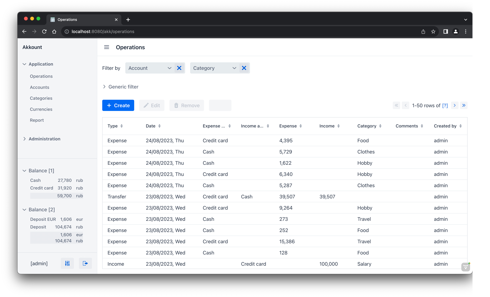
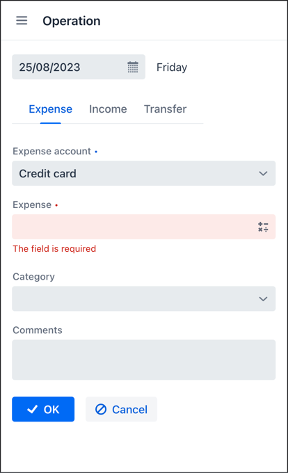

# akkount

A simple personal finance application built with [Jmix](https://jmix.io) framework.



<p align="center">
    
</p>


## Features

In short, the application solves two problems:
 1. It shows the current balance by all accounts: cash, credit cards, deposits, debts, etc.
 2. It can generate a report by expense and income categories that shows where the money came from and what they were spent on in some period of time.

Some details:
* There are _accounts_ that represent different kinds of money.
* There are _operations_: income to account, expense from account and transfer between accounts.
* A _category_ can be set for expense or income operations.
* The current balance is constantly displayed and is recalculated after each operation.
* Categories report shows the summary by two arbitrary periods of time to allow quick visual comparison. Any category can be excluded from the report. You can "drill down" into any row to see operations that comprise the row.
* The system has a fully functional mobile-friendly web UI. 

## Development

You should have PostgreSQL, Java 17+ and Jmix Studio 2.1+ installed on your computer.

- Open the project in Jmix Studio. 
- Right-click on _Data Stores → Main Data Store_ item in Jmix tool window and select _Recreate_. Studio will create and initialize the local `akkount` database.
- Run the application server using *Jmix Application* run/debug configuration.

The application UI is available at http://localhost:8080/akk. Login as `admin` / `admin`. 

You can generate some test data:

- Open _Accounts_ view and click _Generate sample data_.
- Enter the number of days to generate (e.g. 100) in the dialog and click _OK_.

## Building and running

Open the terminal in the project directory and run the following command to build the executable JAR file:

```
./gradlew -Pvaadin.productionMode=true bootJar 
```

The resulting JAR will be created in `build/libs` directory.

Run the application:

```
java -jar akkount-0.6.jar
```

The main UI is available at http://localhost:8080/akk. Username: `admin`, password: `admin`.
